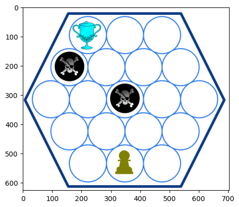

# Double DQN for Tracheal‐Sound “Skull Trophy” Environment

A complete end‐to‐end project demonstrating how to apply a Double Deep Q-Network (Double DQN) to a custom reinforcement-learning task: diagnosing “Skull Trophy” breathing patterns from tracheal sound images.

---

## 📖 Project Overview

**Goal:** Train an agent to recognize and react to respiratory sounds (rendered as 84×84 images) in the `SkullTrophyRLEnv` environment. Each episode begins at one of 17 discrete starting states; the agent selects among six actions to maximize cumulative reward (positive for correct “diagnoses,” negative for missteps).

**Why Double DQN?**  
- Standard DQN can overestimate action-value (Q) functions.  
- Double DQN decouples action selection and evaluation, yielding more stable and accurate updates.

**Key Components:**  
1. **Environment** (`RLSkullTrophy/core.py`):  
   - Provides visual observations of breathing phases.  
   - Defines 17 start states, 6 discrete actions, and a reward scheme.  
2. **Agent** (`main.py`):  
   - Convolutional neural network:  
     - 3 convolution layers (32→64→64 filters), two 2×2 max-pools  
     - Flatten → 1,024-unit fully connected → output Q-values for 6 actions  
   - Training loop with ε-greedy policy, experience replay, target-network updates  
3. **Data Structures:**  
   - **Replay buffer** stores up to 50,000 transitions for randomized minibatch updates.  
4. **Visualization:**  
   - After training, plots of per-episode rewards and 100-episode moving average.  
   - Histogram of steps to success under greedy policy.

## 🖼️ Environment Overview

The `SkullTrophyRLEnv` presents the agent with greyscale 84×84 images of tracheal‐breathing patterns.  
Each episode starts in one of **17 discrete states** representing different phases/positions, and the agent chooses among **6 actions** to maximize reward:

Here’s a representative observation from the `SkullTrophyRLEnv` environment:

<p align="center">
  
</p>

*Figure: Sample 84×84 input image showing the envrionment and current state.*

- **Hex grid** with 19 possible positions.  
- **Blue trophy** marks the goal state.  
- **Black skulls** are traps that incur negative reward.  
- **Green pawn** is the agent’s current position.  
- **Empty circles** are safe, unvisited states.

The agent must navigate from its starting position (green pawn) to the trophy (blue) while avoiding traps (black). 
---

## 📂 Repository Structure

double-dqn/
├── main.py # Single-file training & evaluation script
├── requirements.txt # Third-party dependencies
├── .gitignore # Files/folders excluded from Git
├── LICENSE # MIT license
└── RLSkullTrophy/ # Custom environment package
├── init.py
└── core.py # SkullTrophyRLEnv class & environment logic

## 🔧 Setup & Installation

1. **Clone the repo**  
   ```bash
   git clone https://github.com/YourUserName/double-dqn.git
   cd double-dqn

2. **Create and activate a virtual environment**
python -m venv venv
# Windows PowerShell:
.\venv\Scripts\Activate.ps1
# macOS/Linux:
source venv/bin/activate

3. ** Install dependencies**
pip install -r requirements.txt

## ▶️ Running the Project
Simply launch:
python main.py

By default, this will:

1. Print a summary of the Q-network architecture (parameter counts, memory usage).

2. Train for 6,000 episodes using Double DQN:

 • ε decays from 1.0 → 0.01 over 50,000 steps

 • Target network sync every 1,000 steps

 • Replay-buffer warm-up: 500 initial steps

3. Display training curves: raw rewards & 100-episode moving average.

4. Evaluate the greedy (no-exploration) policy for 1,000 episodes:

 • Reports average reward ± standard deviation

 • Success rate (%)

 • Histogram of steps until success

5. Show a few sample frames from the final episode.

## ⚙️ Hyperparameters & Configuration
| Name                 | Default | Description                                   |
| -------------------- | ------- | --------------------------------------------- |
| `num_episodes`       | 6000    | Total training episodes                       |
| `max_episode_length` | 100     | Max steps per episode                         |
| `warmup_steps`       | 500     | Buffer fill steps before learning starts      |
| `batch_size`         | 64      | Minibatch size for Q-updates                  |
| `discount_factor`    | 0.995   | Reward discount (γ)                           |
| `target_update`      | 1000    | Steps between target network parameter copies |
| `epsilon_start`      | 1.0     | Initial exploration probability (ε)           |
| `epsilon_final`      | 0.01    | Minimum exploration probability               |
| `epsilon_decay`      | 50000   | Number of steps over which ε decays           |

All hyperparameters can be modified directly in main.py.

## 📈 Results & Evaluation
• Training curves:
	Raw per-episode returns (light line) and 100-episode moving average (bold line).
• Evaluation metrics:
	Eval over 1000 greedy episodes:
	Avg Rewards: 15.23 ± 2.47
	Success Rate: 82.5%

## 🚀 Next Steps & Extensions
• Command-line arguments: add argparse to dynamically set hyperparameters.
• Model checkpoints: save & load network weights with torch.save / torch.load.
• TensorBoard logging: integrate torch.utils.tensorboard.SummaryWriter.
• Hyperparameter search: grid-search or Bayesian optimization.
• Environment enhancements: augment observations, refine reward shaping.

## 📦 Dependencies

All required packages are listed in `requirements.txt`:

```text
torch>=1.10.0
gym>=0.21.0
numpy
matplotlib
torchvision
torchinfo
Pillow

Install with:
pip install -r requirements.txt

## 📄 License
This project is licensed under the MIT License. See LICENSE for details.


